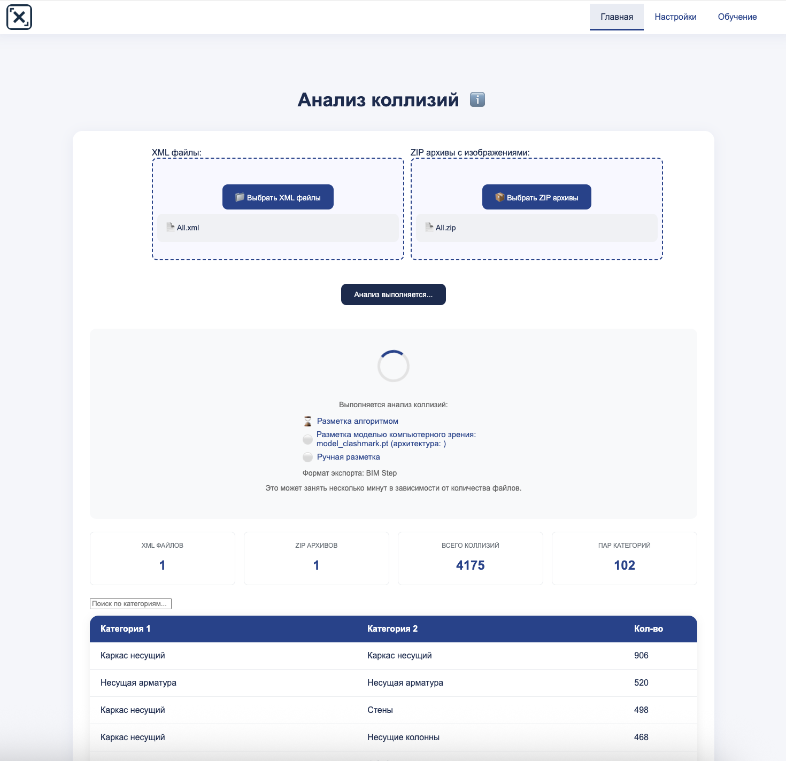
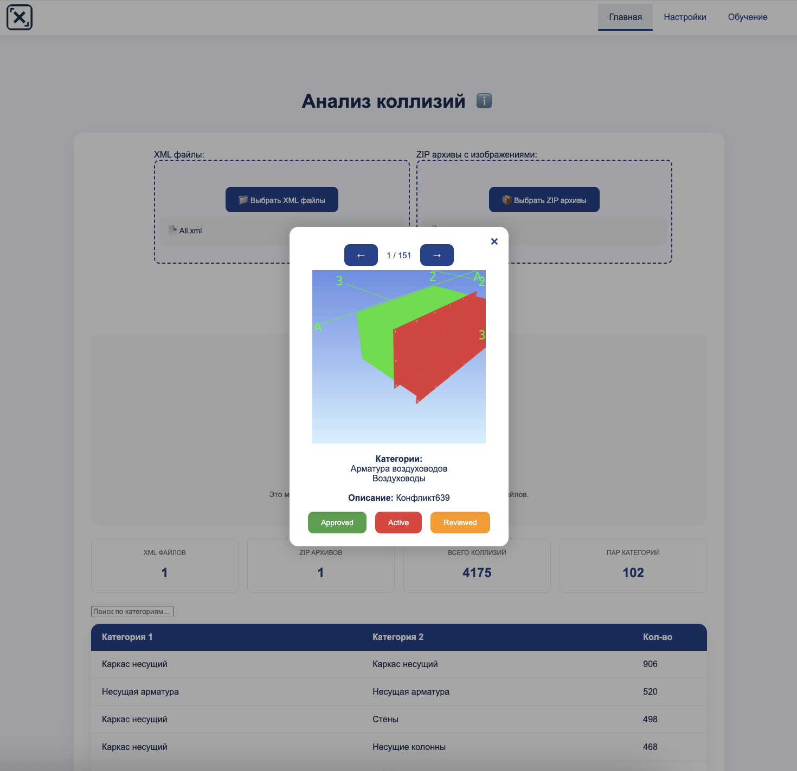
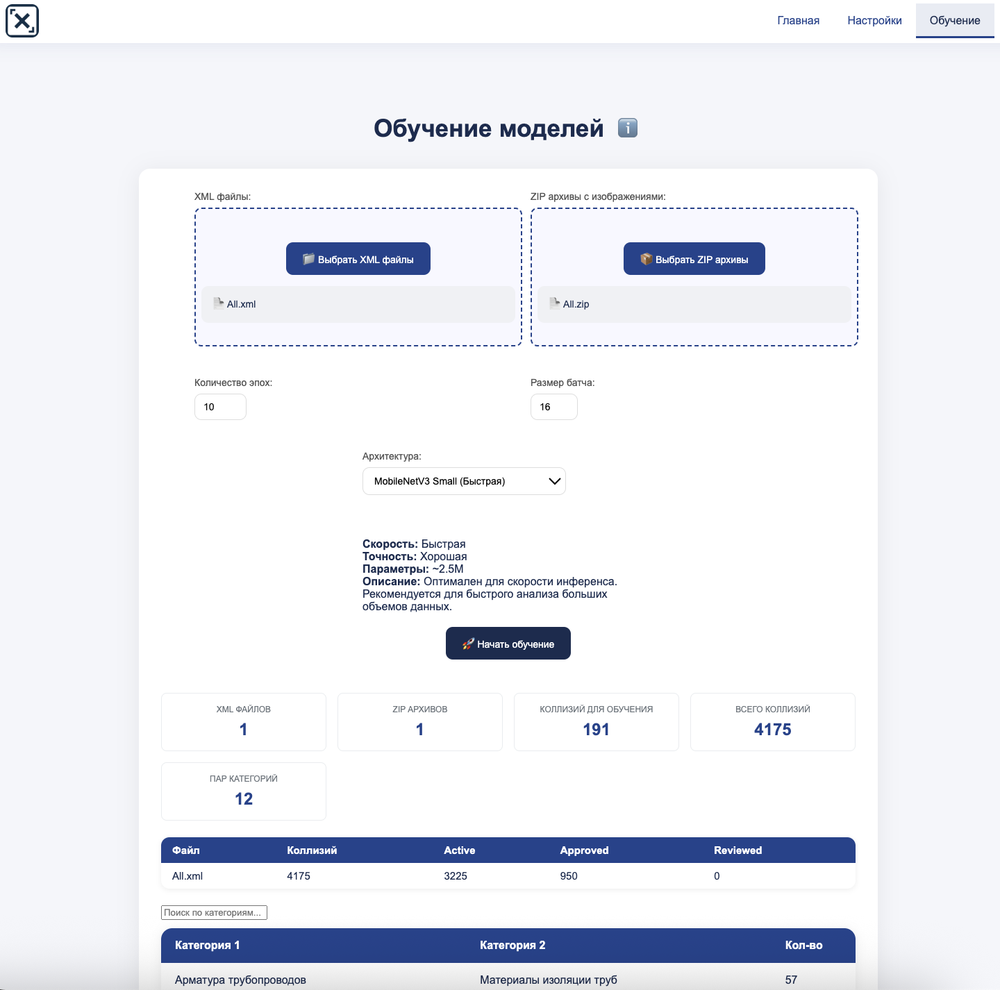
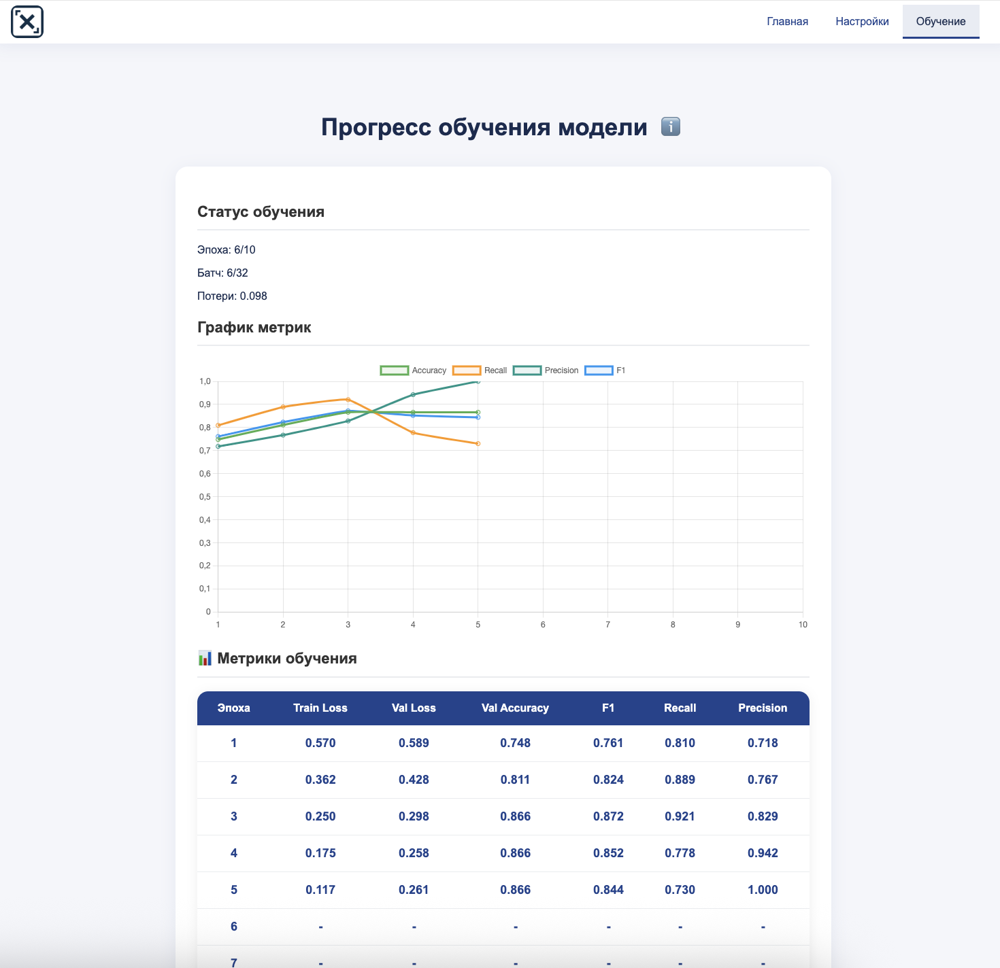
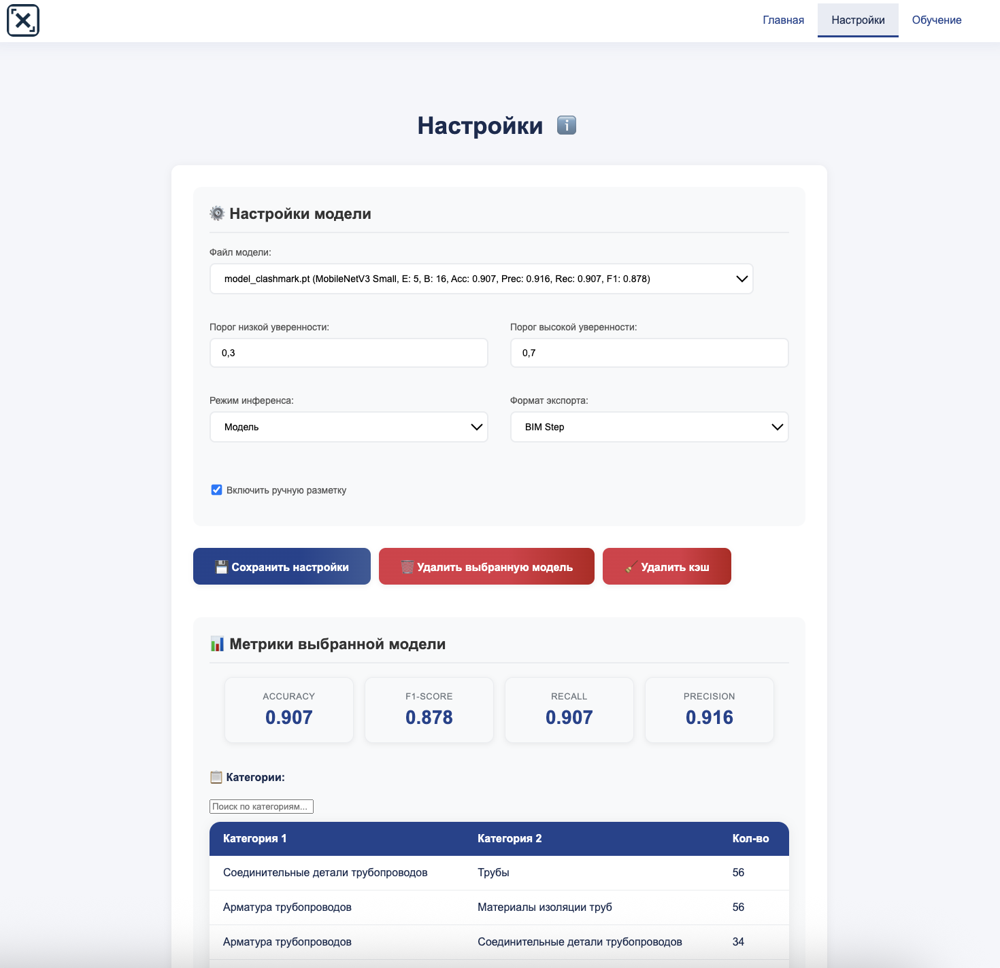
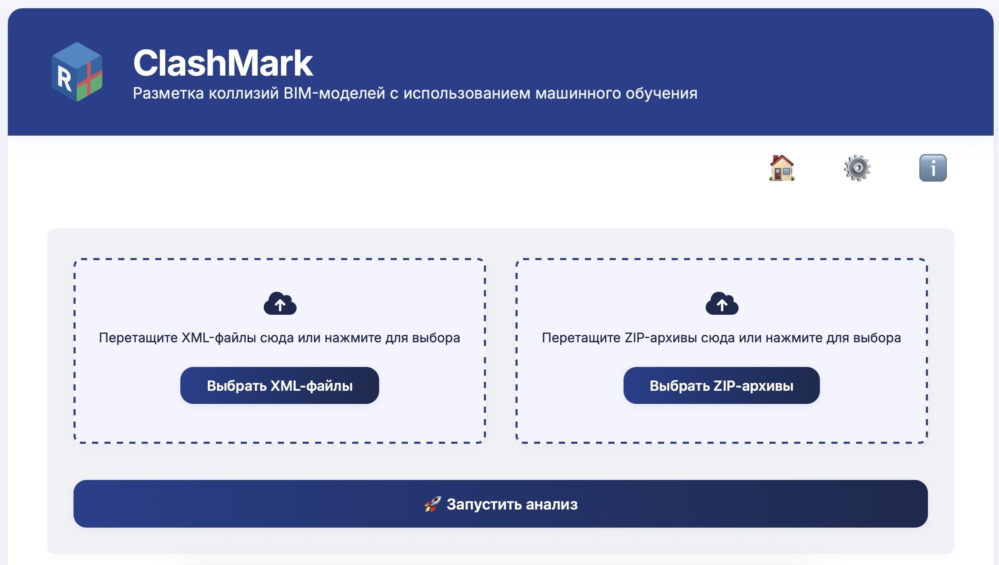

# 🏗 ClashMark — Веб-приложение для анализа коллизий BIM-моделей

[](https://www.python.org/) [](https://flask.palletsprojects.com/) [](https://pytorch.org/) [](LICENSE)

> **Система для автоматизированной классификации и ручной разметки коллизий BIM-моделей с современным веб-интерфейсом, live-графиками и детальной аналитикой**

---

## 📋 Оглавление

* [О проекте](#-о-проекте)
* [Ключевые возможности](#-ключевые-возможности)
* [Архитектура и стек технологий](#-архитектура-и-стек-технологий)
* [Требования](#-требования)
* [Установка и запуск](#-установка-и-запуск)
* [Использование](#-использование)
* [Структура проекта](#-структура-проекта)
* [Подробная инструкция](#-подробная-инструкция)
* [Контакты и поддержка](#-контакты-и-поддержка)

---

## 🔍 О проекте

**ClashMark** — это современное веб-приложение на Flask, предназначенное для автоматизированной загрузки, классификации и разметки коллизий BIM-моделей.
Сервис позволяет обрабатывать XML-отчёты и сопутствующие изображения, анализировать данные с помощью нейросети и формировать детализированные отчёты о коллизиях с красивой визуализацией результатов.

---

## 🚀 Ключевые возможности

* 📂 **Загрузка данных**: поддержка XML-файлов коллизий и ZIP-архивов изображений с предварительным анализом
* 🤖 **Автоматическая классификация**: предсказания категорий коллизий на основе обучаемой модели с настраиваемыми порогами уверенности
* ✍️ **Ручная разметка**: возможность корректировать или задавать метки для случаев с низкой уверенностью модели
* ⚙️ **Гибкая настройка**: управление порогами уверенности, выбор моделей, режимы инференса
* 📈 **Детальная аналитика**: статистика по файлам, распределение по классам, таблицы пар категорий
* 🎯 **Матрица ошибок**: красивая визуализация confusion matrix с цветовой схемой TP/TN/FP/FN
* 📊 **Live-графики**: реальное время отображение прогресса обучения с графиками loss/accuracy
* 🌐 **Современный UI**: унифицированный дизайн, адаптивная верстка, интерактивные элементы
* 📤 **Экспорт результатов**: сохранение отчетов в формате XML и сводной статистики

---

## 🏗 Архитектура и стек технологий

**Стек:** Python 3.8+, Flask, PyTorch, pandas, NumPy, lxml, PyYAML

| Компонент          | Технологии    |
| ------------------ | ------------- |
| Веб-сервер         | Flask         |
| Модель             | PyTorch (MobileNetV3) |
| Разметка и экспорт | lxml, PyYAML  |
| Аналитика          | pandas, NumPy |
| Frontend           | HTML5, CSS3, JavaScript |
| Визуализация       | Chart.js, современные CSS-анимации |

---

## 📋 Требования

* Python >= 3.8
* Flask >= 2.0
* torch >= 1.9
* pandas >= 1.3
* numpy >= 1.21
* lxml >= 4.6
* PyYAML >= 5.4

Все зависимости перечислены в [`requirements.txt`](requirements.txt).

---

## 🐳 Быстрый старт с Docker

### 1. Сборка и запуск через Docker

```bash
# Сборка образа
sudo docker build -t clashmark .
# Запуск контейнера с пробросом порта и volume для моделей
sudo docker run -p 5001:5001 -v $(pwd)/model:/app/model clashmark
```

### 2. Запуск через docker-compose

```bash
docker-compose up --build
```

- Все файлы, которые вы кладёте в папку `model/` на вашей машине, будут доступны внутри контейнера по пути `/app/model`.
- Контейнер запускает gunicorn на 0.0.0.0:5001 (доступен снаружи).
- Для обновления модели просто замените файл в папке `model/` — контейнер увидит изменения.

---

## 🖼️ Примеры интерфейса

| Описание | Скриншот |
|----------|----------|
| Главная страница: загрузка XML и ZIP, просмотр статистики, запуск анализа |  |
| Ручная разметка: окно для корректировки спорных коллизий |  |
| Страница обучения: загрузка данных, настройка параметров, запуск обучения |  |
| Live-графики: прогресс обучения, метрики, матрица ошибок |  |
| Страница настроек: выбор модели, пороги, просмотр метрик |  |

---

## 💡 Использование



### **Главная страница (Анализ коллизий)**
1. Загрузите XML-файл(ы) с коллизиями и ZIP-архив(ы) с изображениями
2. Просмотрите предварительную статистику: количество файлов, коллизий, пар категорий
3. Выполните автоматический анализ с выбранными настройками
4. При необходимости разметьте спорные результаты вручную
5. Скачайте итоговые отчёты в XML формате


### **Обучение модели**
1. Перейдите на вкладку "Обучение модели"
2. Загрузите обучающие данные (XML + изображения)
3. Укажите параметры обучения (batch size, epochs)
4. Запустите процесс — автоматически откроется страница live-прогресса
5. Наблюдайте за графиками loss/accuracy в реальном времени
6. Просмотрите итоговые метрики и матрицу ошибок


### **Настройки**
1. Выберите модель для инференса из списка доступных
2. Настройте пороги уверенности (низкий/высокий)
3. Выберите режим инференса (модель/алгоритм)
4. Просмотрите метрики выбранной модели и матрицу ошибок
5. Настройте формат экспорта (стандартный/BIMStep)


---

## 📁 Структура проекта

```
ClashMark/
├── app.py                       # Основной Flask-сервер
├── core/                        # Утилиты для XML, парсинга, экспорта
│   ├── __init__.py
│   ├── image_utils.py           # Обработка изображений
│   └── xml_utils.py             # Парсинг и экспорт XML
├── ml/                          # Модули обучения и инференса
│   ├── __init__.py
│   ├── model.py                 # Архитектура модели (MobileNetV3)
│   ├── train.py                 # Обучение модели
│   ├── inference.py             # Инференс
│   └── dataset.py               # Датасет и загрузка данных
├── web/                         # Веб-интерфейс (роуты, обработчики)
│   ├── __init__.py
│   ├── settings.py              # Обработка настроек
│   └── utils.py                 # Утилиты веб-интерфейса
├── templates/                   # HTML-шаблоны
│   ├── base.html                # Базовый шаблон
│   ├── index.html               # Главная страница
│   ├── train.html               # Страница обучения
│   ├── settings.html            # Страница настроек
│   └── macros.html              # Jinja2 макросы
├── static/                      # Стили, JS, изображения
│   ├── style.css                # Основные стили
│   ├── scripts.js               # JavaScript функциональность
│   └── logo.png                 # Логотип
├── category_pairs.yaml          # Описание категорий для классификации
├── model/                       # Обученные модели и статистика
│   ├── model_train_log.json     # Лог обучения
│   └── *.pt                     # Обученные модели PyTorch
├── requirements.txt             # Зависимости Python
└── README.md                    # Документация проекта
```

---

## 📖 Подробная инструкция

См. файл [`INSTRUCTION.md`](INSTRUCTION.md) для пошагового руководства по работе с системой, настройке, обучению и инференсу моделей, а также форматам входных/выходных данных.

---

## ✉️ Контакты и поддержка

**Автор:** Мельник Даниил  
* Email: [git@danieln.ru](mailto:git@danieln.ru)  
* GitHub: [DanielNRU](https://github.com/DanielNRU)  
* Hugging Face: [DanielNRU](https://huggingface.co/DanielNRU)

---